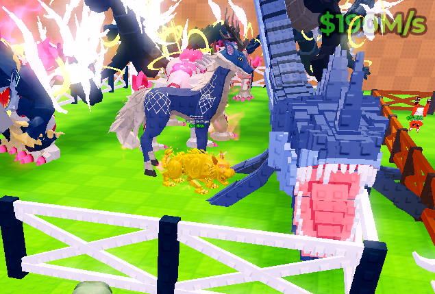
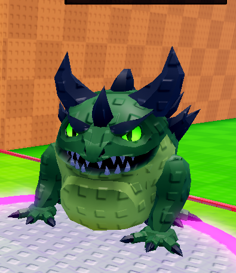

# Supplied premium-creature references

These images were supplied by the user as visual direction. Their source game, creators, asset
construction, unseen anatomy, and performance are not established. They are inspiration for
original Steal a Seed plants and pods, not assets to extract or re-upload.

## A. Long maw and floral body plans

### What is visible

- The foreground blue creature uses an exceptionally long head/mouth region and two tall upward
  projections. Its body is partly outside the image, so the complete stance cannot be recovered.
- Layered rectangular/faceted surface marks run along larger blue structural forms. At this scale
  they supply a toy-like, studded or tiled surface rhythm; the screenshot does not prove how built.
- Pale tooth-like edges frame a bright pink mouth interior. Blue versus pink and pale versus dark
  make the mouth the focal point despite a crowded environment.
- Behind it is a side-on, horse-like quadruped with a dark blue torso, pale lower legs, a flowing
  pale tail/mane, and pink flower-like clusters above the neck/back. Fine pale markings appear on
  the flanks. This is a different silhouette, not the same body with a new head ornament.
- A smaller golden creature sits low near its feet, adding another mass/height contrast, but its
  anatomy is too obscured to identify confidently.
- The garden, fence, neighboring creatures, UI and large bright branching effects overlap. It is
  not possible to assign every halo or streak to a particular creature from this view.

### Transfer to our art

Use an exaggerated mouth with a structural rim and real depth, then subordinate surface detailing
to it. In a plant, that could become a split pitcher bloom or elongated root-beast jaw; these are
unapproved concept possibilities, not species names to register.

Use the floral quadruped to study continuous limbs, mane flow, and contrasting color zones. Root
legs, a bark torso and a petal mane can establish botanical anatomy without copying the pictured
animal. Distinguish neighboring premium species by body plan, posture, and dominant proportion.

### Do not copy blindly

The mouth appears large partly because it is close to the camera. Do not infer exact lengths,
scales, or ratios from this perspective. Do not reproduce the clipped framing, crowded overlays,
income number, oversized garden occupancy, or blown-out background glow. The UI's $120M/s is not
an economy target. This picture proves neither an articulated jaw nor a working walk cycle.

## B. Crouching horned creature

### What is visible

A broad green creature crouches on short connected limbs. Large dark tapered horns frame the
upper silhouette, while a smaller central projection anchors the brow. Heavy green brows sit over
bright eyes; a dark, recessed-looking mouth is framed by uneven pale teeth. A lighter belly is
bounded by darker shoulders and outer limbs. Scattered raised surface marks give it a studded toy
finish, with smoother gaps between marks.

### Transfer to our art

Prioritize the relationship between brow, recessed mouth, horn taper and planted stance. Preserve
the sense of a unified torso even when it is built from several overlapping primitive masses.
Rounded fullness is compatible with freeform anatomy; visible sphere stacking is not the target.
Use fewer intentional horns/plates rather than covering every boundary in spikes. Do not confuse
the bright eyes with permission to repaint previously approved Starbloom eyes.

## Shared interpretation and limits

Both references make primary anatomy readable under secondary surface detail. Neither suggests
that every new plant needs the same horns, open mouth, palette, or leg count. A calm Divine plant
can be equally premium if its crown, posture, and face are authored with the same clarity.

Use this review order: effects off -> solid silhouette -> structural color zones -> carved face
and limb connections -> selective surface rhythm -> controlled effects -> motion in context.
If a step fails, fix it before spending parts on the next one. Exact styling remains the user's
approval decision; this analysis is a design interpretation, not a measured reconstruction.
